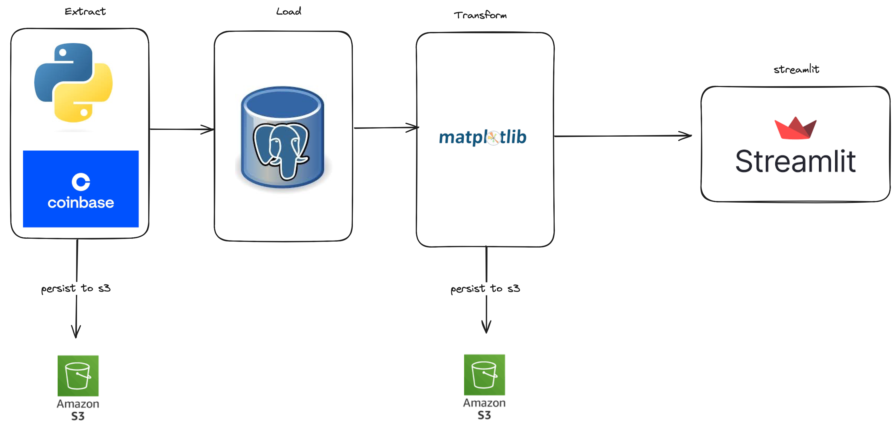

# Supply and Demand Analytics of Crypto Assets

## Project Purpose

This project aims to build a comprehensive data pipeline that fetches historical cryptocurrency data for the last 7 days, persists the data to an Amazon S3 bucket, and then saves the data to a PostgreSQL database. Users can access a supply and demand analysis chart for selected tokens through a Streamlit interface.

## Architecture 

The pipeline follows an ELT architecture where data is loaded from the API as a json object and persisted into an Amazon S3 bucket in csv file format. The data is then loaded into a postgres database where each token has a table with the historical data as the values. An interface is added using streamlit where users can check tokens and get their supply and demand zones using technical analysis libraries. 



## Data Source 
    - Coinbase API 
  
## Data Processing 
An ELT pipeline implementation 

## Scheduling and Orchestration 
The pipeline was scheduled and orchestrated using airflow and DAGs with tasks dependencies outlined in the script 


## Setup Instructions

### Prerequisites

- Python 3.8 or higher
- PostgreSQL 12 or higher
- AWS Account with S3 access
- Airflow 2.0 or higher

### Installation

1. **Clone the repository:**
   ```bash
   git clone https://github.com/yourusername/crypto-data-pipeline.git
   cd crypto-data-pipeline
   ```

2. **Set up a virtual environment:**
   ```bash
   python -m venv venv
   source venv/bin/activate  # On Windows use `venv\Scripts\activate`
   ```

3. **Install the dependencies:**
   ```bash
   pip install -r requirements.txt
   ```

4. **Set up environment variables:**
   Create a `.env` file in the project root and add the following:
   ```ini
   AWS_ACCESS_KEY_ID=your_aws_access_key_id
   AWS_SECRET_ACCESS_KEY=your_aws_secret_access_key
   AWS_BUCKET_NAME=your_s3_bucket_name
   DB_HOST=your_db_host
   DB_NAME=your_db_name
   DB_USER=your_db_user
   DB_PASSWORD=your_db_password
   ```

5. **Initialize Airflow:**
   ```bash
   airflow db init
   airflow users create --username admin --firstname Admin --lastname User --role Admin --email admin@example.com
   ```

6. **Start the Airflow web server and scheduler:**
   ```bash
   airflow webserver --port 8080
   airflow scheduler
   ```

### Usage

1. **Trigger the DAG:**
   - Access the Airflow UI at `http://localhost:8080`.
   - Trigger the `crypto_data_pipeline` DAG manually or let it run on its schedule.

2. **Access the Streamlit interface:**
   - Run the Streamlit app:
     ```bash
     streamlit run app.py
     ```
   - Open your browser and navigate to `http://localhost:8501` to view the supply and demand analysis chart.

### Project Structure

```
crypto-data-pipeline/
│
├── dags/
│   ├── crypto_data_pipeline.py
│   └── utils.py
├── data/
├── temp/
├── app.py
├── requirements.txt
└── README.md
```

### DAG Details

- **Name:** crypto_data_pipeline
- **Schedule:** Runs every 7 days
- **Tasks:**
  - `get_historical_data`: Fetches historical data for a list of tokens.
  - `save_to_s3`: Saves the fetched data to an S3 bucket.
  - `save_to_postgres`: Saves the fetched data to a PostgreSQL database.


### Slide 9: Technical Tools and Technologies

- **Airflow:** Task orchestration.
- **AWS S3:** Cloud storage.
- **PostgreSQL:** Database management.
- **Streamlit:** Data visualization.
- **Python Libraries:** Pandas, requests, boto3, psycopg2.

### Slide 10: Closing Statement

- **Summary:**
  - Demonstrated ability to handle complex data engineering tasks.
  - Successfully integrated multiple technologies to create a robust data pipeline.
  - Enabled effective collaboration and agile adaptation to project requirements.

- **Thank You!**